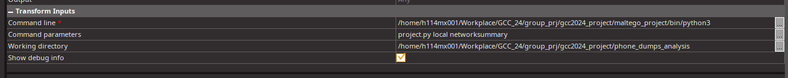

# gcc2024_project

Assume you have Docker & Docker Compose installed. (Docker Desktop is enough to have these two)

## Build 

```bash 
git clone https://github.com/UltimateHG/gcc2024_project/ && cd gcc2024_project
cd phone_dumps_analysis 
pip install -r requirements.txt
docker compose up -d --build
```

## Import the transformation in Maltego

